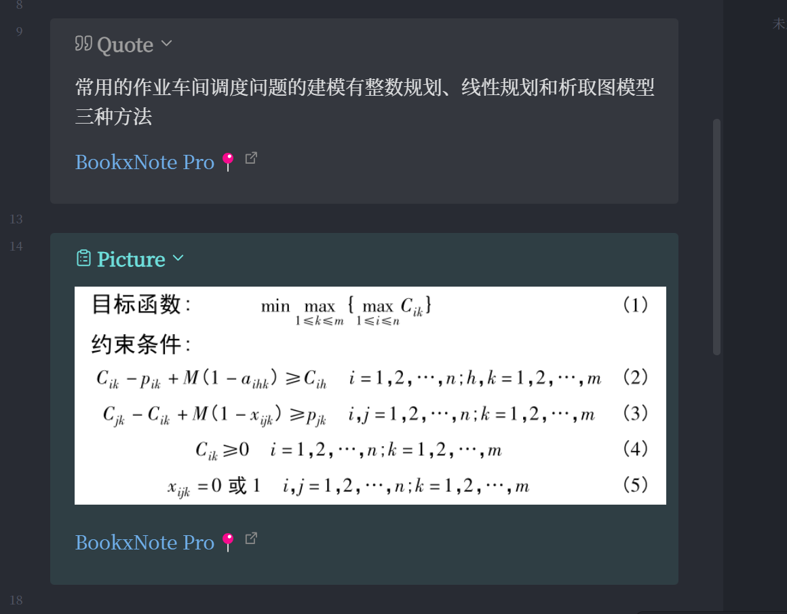
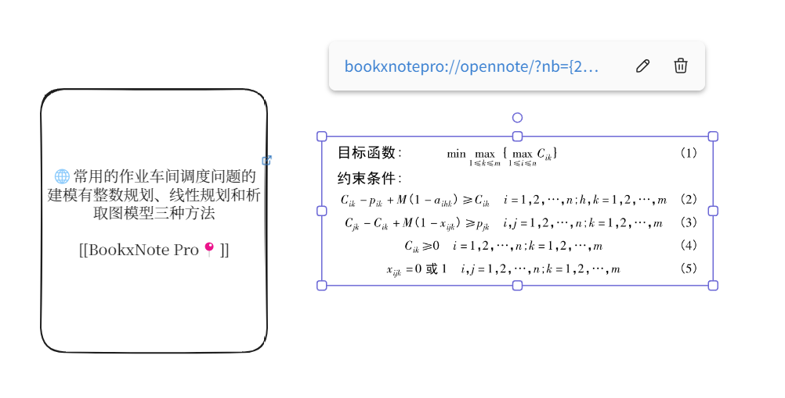
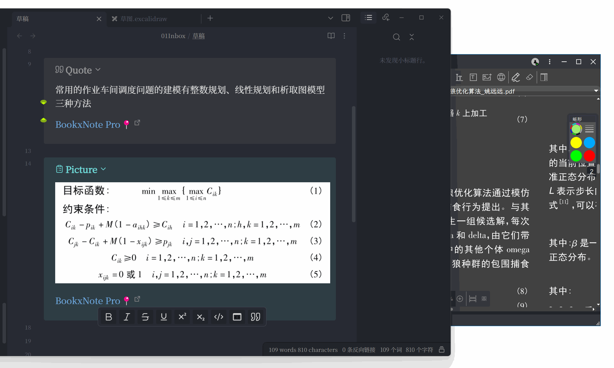
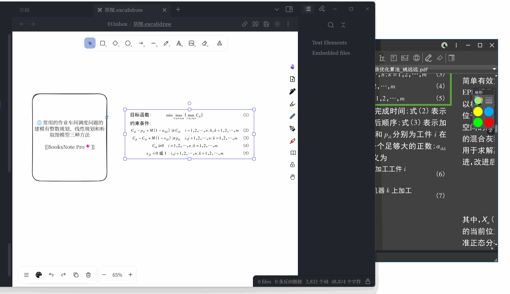
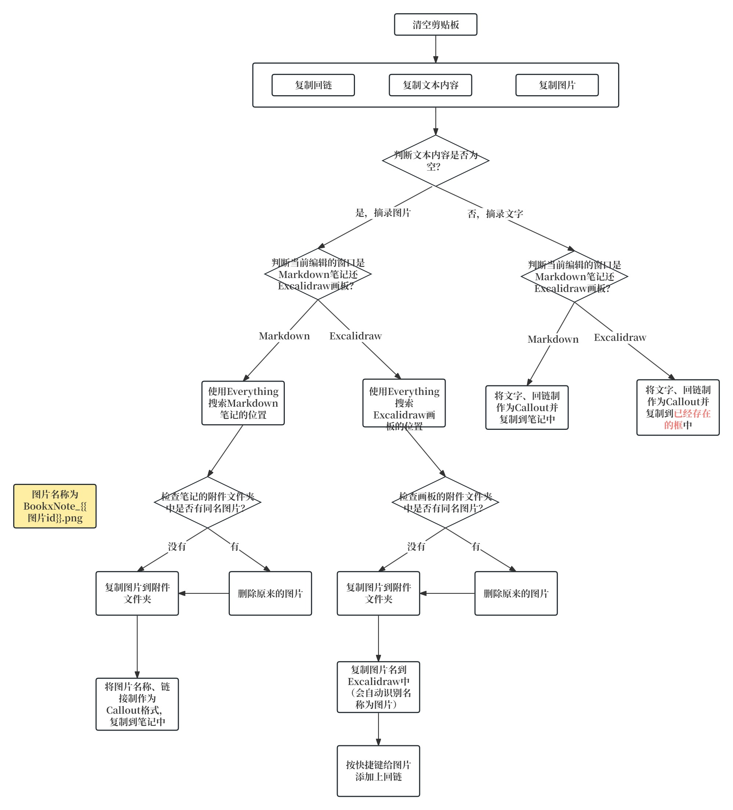

# 用Quicker设置Obsidian到BookxNote的跳转、回链动作

知乎文字链接：[用Quicker设置Obsidian到BookxNote的跳转、回链动作](https://zhuanlan.zhihu.com/p/690386301)

哔哩哔哩视频链接：[Obsidian与BookxNote：用Quicker摘录内容，并带上回链](https://www.bilibili.com/video/BV1Ki421k7tZ/?spm_id_from=333.1387.homepage.video_card.click&vd_source=c08c205650a4a5e13d87475ab1ab2431)

用Quicker可以帮助我们完成一些繁琐的、需要多个操作步骤的动作。

这篇文章中，我用Quicker帮我完成对BookxNote的复制文字、复制图片、复制回链、复制图片到Obsidian文件夹、将链接按照callout格式复制到Obsidian笔记中，使之点击Obsidian中的链接能自动打开BookxNote，并跳转到笔记的所在位置。

摘录的文字、图片到Obsidian中Markdown的样式：

摘录的文字、图片到Obsidian中Excalidraw的样式：

点击Markdown链接跳转到BookxNote：

点击Excalidraw链接跳转到BookxNote：

制作Quicker动作的思路：

使用的方法：选中标注的文字或框起来的图片，点击Quicker动作，到Obsidian里点击剪贴位置，然后按ctrl+v就可以了。我平时用Obsidian和Typora编辑文档，因此动作中加了识别Typora窗口的部分。

我将Quicker动作、不同的摘录情况的调试运行详情放到了[github仓库](https://github.com/operations4304/BookxNote-Obsidian)

**但不幸的是，如果您直接用肯定是没法用的**。因为时间精力有限，没法做成普遍适用的动作。

所以这里提供的是实现的思路，以及可以参考的某些步骤的动作的写法。

如果你对图片的复制方式不清楚，可以查看这篇文章，[附件管理方式](https://zhuanlan.zhihu.com/p/690376509)，介绍了附加的储存情况。

该Quicker参考了[Obsidian-Excalidraw联动BookxNote Pro](https://www.bilibili.com/video/BV1zW4y1Z7ke/?spm_id_from=333.999.0.0&vd_source=c08c205650a4a5e13d87475ab1ab2431)

谢谢观看！
